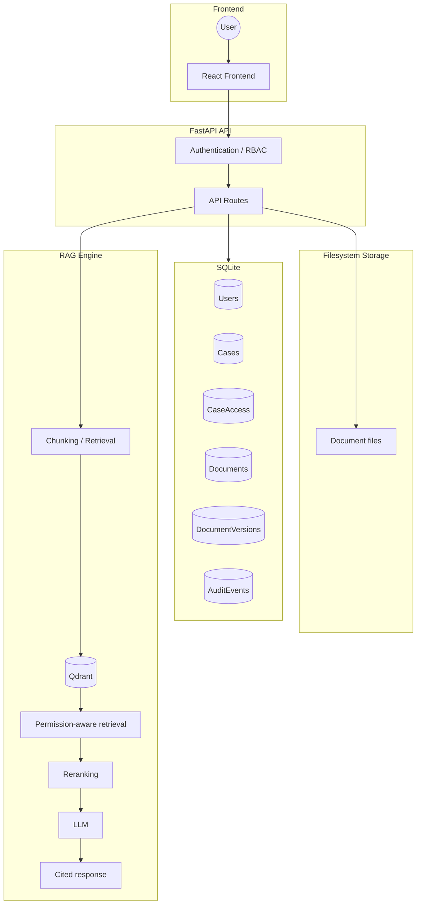

# 02. System Architecture

## Architecture Overview
SIH26190 is designed with a strictly enforced boundary between the presentation layer and the data layer. Authorization occurs strictly at the backend API layer. 

The architecture guarantees that:
1. Metadata and roles are managed by SQLite (immutable source of truth).
2. Document physical storage relies on the server filesystem.
3. The AI RAG system receives mandatory authorization lists before interacting with Qdrant.

## Diagram

## Security Boundary
**VERIFIED:** Authorization is strictly enforced in the FastAPI backend via the `require_case_access` and `get_authorized_cases` dependencies. 
Frontend visibility (e.g. hiding a document from the React dashboard) is **not** the security boundary. Direct API calls using an unauthorized JWT will result in a `403 Forbidden` response and an `ACCESS_DENIED` entry in the `AuditEvents` table.
