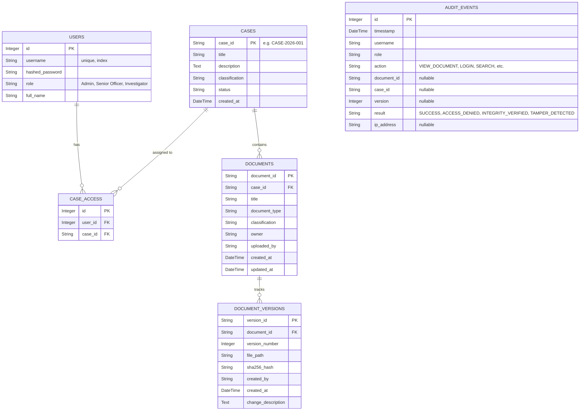

# 03. Database Schema

## Implementation Note
**VERIFIED:** The schema documented below matches the exact SQLAlchemy implementation in `backend/app/models.py`.

## Entity-Relationship Diagram

## Tables Explained

### User
Tracks system actors. Passwords are mathematically hashed with bcrypt. 

### Case
The primary container for documents. Authorization is granted at the Case level.

### CaseAccess
The mapping table granting specific Users access to specific Cases.

### Document
The logical representation of a file. It acts as an umbrella for its physical versions.

### DocumentVersion
The immutable representation of a physical file at a point in time. It stores the exact `sha256_hash` used for tamper detection and the `file_path` on the storage drive.

### AuditEvent
An immutable ledger tracking every significant action performed in the system, specifically recording `ACCESS_DENIED` and `TAMPER_DETECTED` events for security review.
