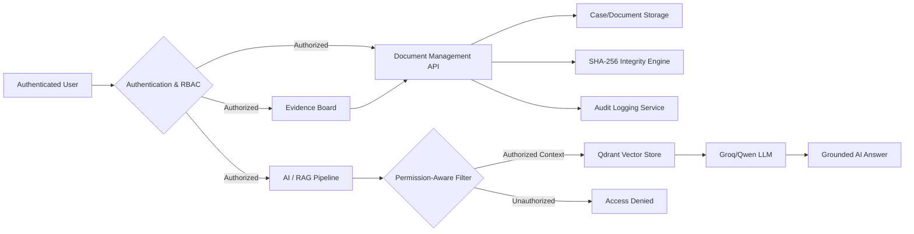
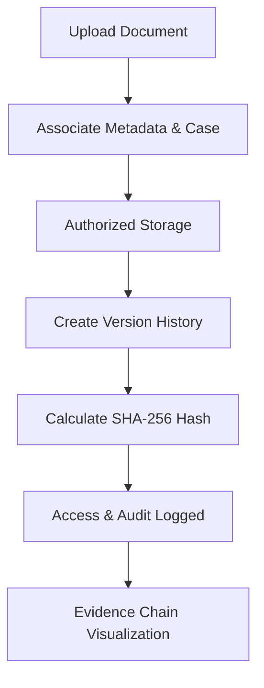
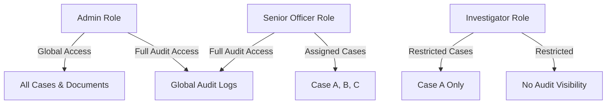
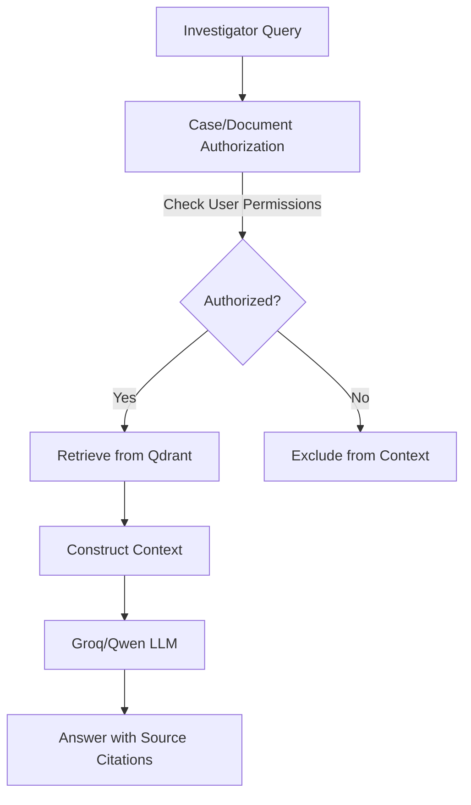
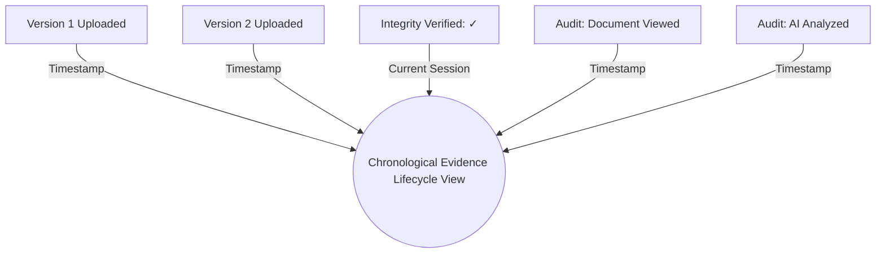

# SIH26190 System Architecture

This document describes the architecture and data flows of the **SIH26190 Secure Digital Document Management System**.

## 1. Overall System Architecture

## 2. Secure Document Lifecycle

## 3. Role-Based Access Control (RBAC)

## 4. Permission-Aware AI/RAG

## 5. Evidence Chain

*Note: The internal Qdrant collection is named `sih26189_evidence` due to prototype legacy compatibility. It contains strictly SIH26190 relevant documents.*
